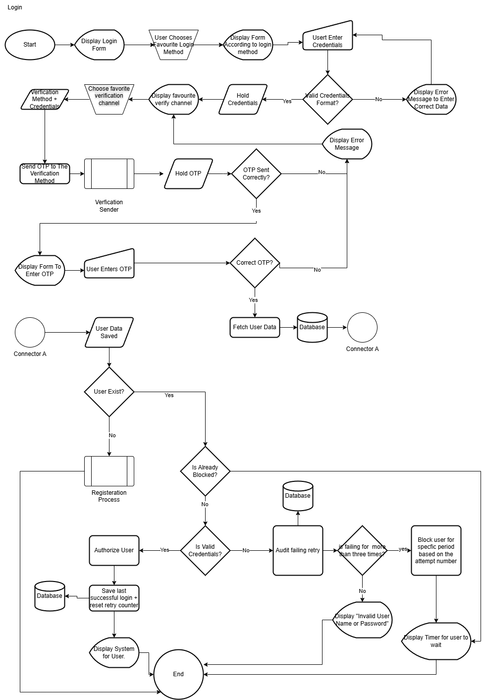
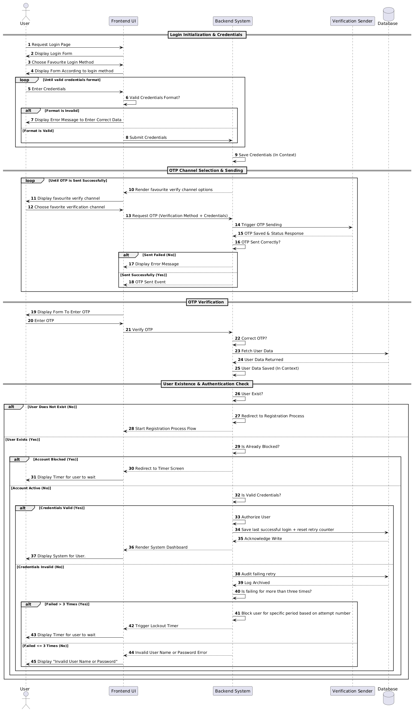
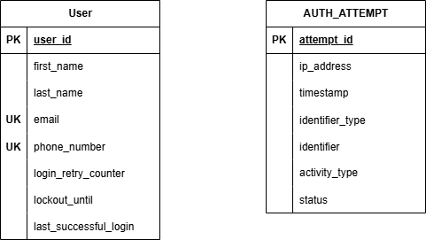
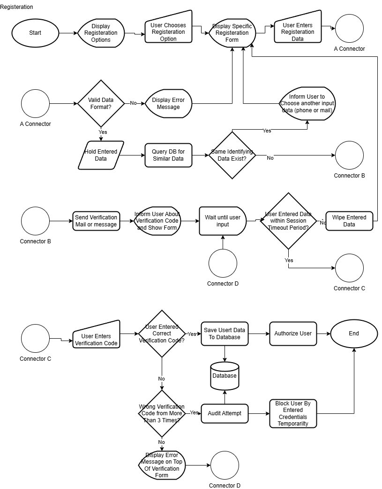
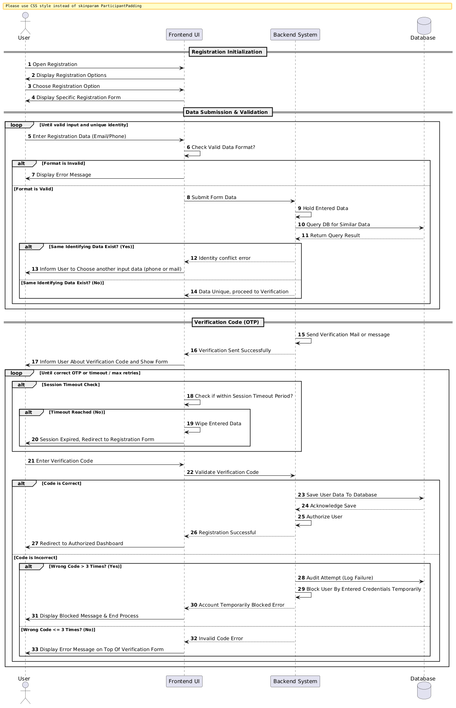

# Food Delivery App — Project Notes

Overview
--------
This repository contains notes, diagrams and pseudocode for a food delivery application project. The README is organized into weekly sections:

- Section 1 — Food Delivery Features and Functions (Week 8)
- Section 2 — User Registration and Login (Week 9)

Table of contents
-----------------
- [Section 1 — Food Delivery Features and Functions (Week 8)](#section-1-week-8)
- [Section 2 — User Registration and Login (Week 9)](#section-2-week-9)
  - [Login](#login)
    - [Flowchart](#login-flowchart)
    - [Sequence diagram](#login-sequence-diagram)
    - [Pseudocode](#login-pseudocode)
    - [ERD](#erd)
  - [Registration](#registration)
    - [Flowchart](#registration-flowchart)
    - [Sequence diagram](#registration-sequence-diagram)
    - [Pseudocode](#registration-pseudocode)

---

<h2 id="section-1-week-8">Section 1 — Food Delivery Features and Functions (Week 8)</h2>

The Talabat features and functions (sourced from `attachments/talabatFeaturesAndFunctions.txt`) are listed below, grouped for readability.

Store Management
- Add Store — Add a store (restaurant, dine-in restaurant, pharmacy...) and choose its type during addition.
- Remove Store
- Hide / Show Store
- Mark as Closed / Open
- Automated Opening/Closing
- Calculate/Add/Collect Store Addition Cost
- Query Store Expenses
- Store Sales Report

Inventory Management
- Add Product
- Add Product with Multi-Options (and default options)
- Add Product Categories
- Delete Product
- Increase / Decrease Product Stock
- Calculate Stock
- Temporarily Hide / Show Hidden Product
- Change Product Price (including time-limited price)
- Edit Product Attributes (name, description, etc.)

Customer Management
- Registration (email or phone)
- Password Recovery
- Send Confirmation Email
- Show Customer Data
- Add Address / Set Main Address
- Show Map
- Save & Show Customer Preferences
- Search Nearby Stores

Application & Interface
- Change Language
- Support and Help

Order Management
- Browse store categories
- Search (store or product name)
- Filter & sort search results
- Open store menu & browse products
- Add product to cart / delete from cart
- Multi-cart retention across stores
- Show product & cart statistics
- Send order to store
- Change order status / notify customer
- Available payment methods / order summary
- Complete order / browse past orders
- Disable order / report a problem

Courier Management
- Add / Delete courier
- Search nearby couriers
- Assign courier to store
- Show amount details / maps to store & customer
- Mark order received by restaurant / customer
- Collect order amount / non-collection complaint

Payments
- Add / verify / save card
- Add / delete / disable payment method
- Collect money from bank / wallet / manual collection
- Buy Now Pay Later (balance add/deduct, schedule collection)

Customer Service
- Add / delete representative
- Show data to representative
- Instant messaging between representative and customer
- Store complaint/help state
- Add balance to customer

System Administration
- Show store statistics
- Manage settings

---


<h2 id="section-2-week-9">Section 2 — User Registration and Login (Week 9)</h2>

This section groups artifacts for login and registration. Start with Login, then Registration.

<h3 id="login">Login</h3>

<h4 id="login-flowchart">Flowchart</h4>



<h4 id="login-sequence-diagram">Sequence diagram</h4>




<h4 id="login-pseudocode">Pseudocode</h4>

```text
FUNCTION LoginFlow():
    START
    
    Display Login Form
    User Chooses Favourite Login Method
    Display Form According to login method
    
    LABEL UserEntersCredentials:
    User Enter Credentials
    
    IF NOT (Valid Credentials Format?) THEN
        Display Error Message to Enter Correct Data
        GOTO UserEntersCredentials
    ELSE
        Save Credentials in Memory
        Display favourite verify channel
        Choose favorite verification channel
        Verification Method + Credentials
        GOTO SendOTP
    ENDIF

    LABEL SendOTP:
    Send OTP to The Verification Method
    Verification Sender (Subprocess)
    OTP Saved in Memory
    
    IF NOT (OTP Sent Correctly?) THEN
        Display Error Message
        GOTO DisplayFavouriteVerifyChannel 
    ELSE
        GOTO DisplayFormToEnterOTP
    ENDIF

    LABEL DisplayFavouriteVerifyChannel:
    Display favourite verify channel
    Choose favorite verification channel
    Verification Method + Credentials
    GOTO SendOTP

    LABEL DisplayFormToEnterOTP:
    Display Form To Enter OTP
    User Enters OTP
    
    IF (Correct OTP?) THEN
        Fetch User Data
        Query Database
        GOTO CheckUserExistence
    ELSE
        Display Error Message
        GOTO DisplayFormToEnterOTP
    ENDIF

    LABEL CheckUserExistence:
    User Data Saved
    
    IF NOT (User Exist?) THEN
        Registration Process (Subprocess)
        GOTO EndProcess
    ELSE
        GOTO CheckAlreadyBlocked
    ENDIF

    LABEL CheckAlreadyBlocked:
    IF (Is Already Blocked?) THEN
        GOTO DisplayTimerForUserToWait
    ELSE
        IF (Is Valid Credentials?) THEN
            Authorize User
            Save last successful login + reset retry counter (Write to Database)
            Display System for User.
            GOTO EndProcess
        ELSE
            Audit failing retry (Write to Database)
            
            IF (is failing for more than three times?) THEN
                Block user for specific period based on the attempt number
                GOTO DisplayTimerForUserToWait
            ELSE
                Display "Invalid User Name or Password"
                GOTO EndProcess
            ENDIF
        ENDIF
    ENDIF

    LABEL DisplayTimerForUserToWait:
    Display Timer for user to wait
    GOTO EndProcess

    LABEL EndProcess:
    END
```

<h4 id="erd">ERD (For Login and Registration)</h4>



<h3 id="registration">Registration</h3>

<h4 id="registration-flowchart">Flowchart</h4>



<h4 id="registration-sequence-diagram">Sequence diagram</h4>




<h4 id="registration-pseudocode">Pseudocode</h4>

```text
FUNCTION RegistrationFlow():
    START
    
    Display Registration Options
    User Chooses Registration Option
    
    LABEL SpecificRegistrationForm:
    Display Specific Registration Form
    User Enters Registration Data
    GOTO ConnectorA
    
    LABEL ConnectorA:
    IF NOT (Valid Data Format?) THEN
        Display Error Message
        GOTO SpecificRegistrationForm
    ELSE
        Hold Entered Data
        Query DB for Similar Data
        
        IF (Same Identifying Data Exist?) THEN
            Inform User to Choose another input data (phone or mail)
            GOTO SpecificRegistrationForm
        ELSE
            GOTO ConnectorB
        ENDIF
    ENDIF
    
    LABEL ConnectorB:
    Send Verification Mail or message
    Inform User About Verification Code and Show Form
    
    LABEL ConnectorD:
    Wait until user input
    
    IF NOT (User Entered Data within Session Timeout Period?) THEN
        Wipe Entered Data
        GOTO SpecificRegistrationForm
    ELSE
        GOTO ConnectorC
    ENDIF
    
    LABEL ConnectorC:
    User Enters Verification Code
    
    IF (User Entered Correct Verification Code?) THEN
        Save User Data To Database (Write to Database)
        Authorize User
        GOTO EndProcess
    ELSE
        IF (Wrong Verification Code from More than 3 Times?) THEN
            Audit Attempt
            Block User By Entered Credentials Temporarily
            GOTO EndProcess
        ELSE
            Display Error Message on Top Of Verification Form
            GOTO ConnectorD
        ENDIF
    ENDIF
    
    LABEL EndProcess:
    END
```
Registration ERD
--------
Registration flow uses the same ERD as the Login section. See [ERD (Login)](#erd).
